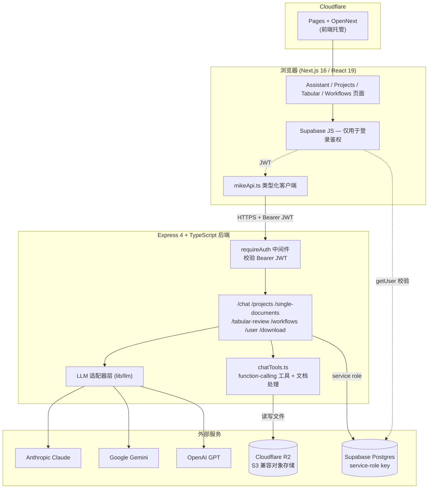
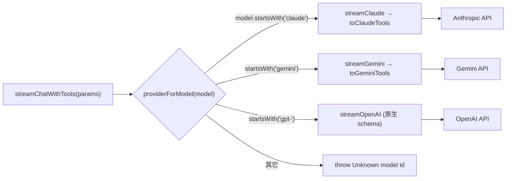
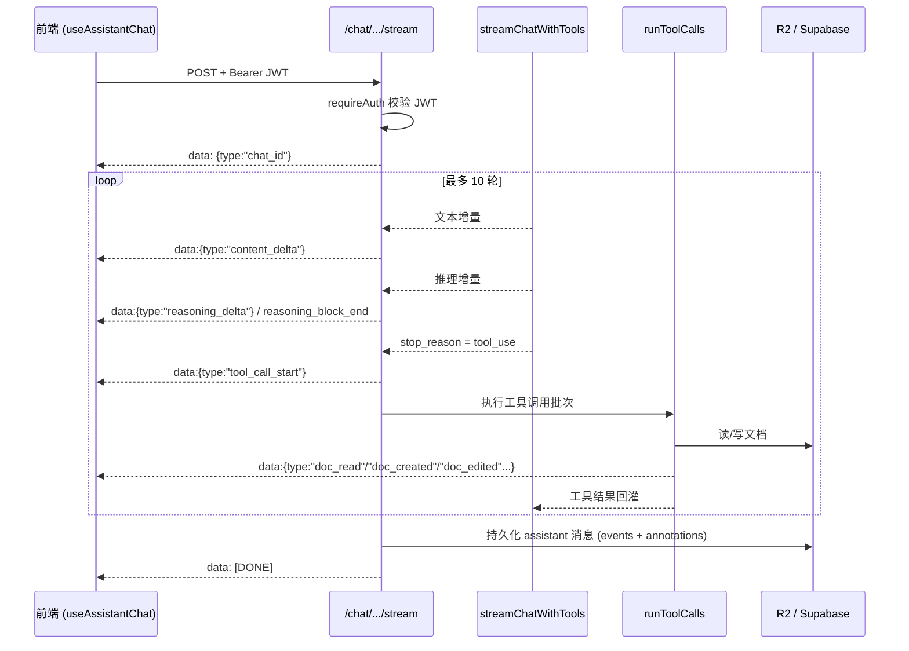
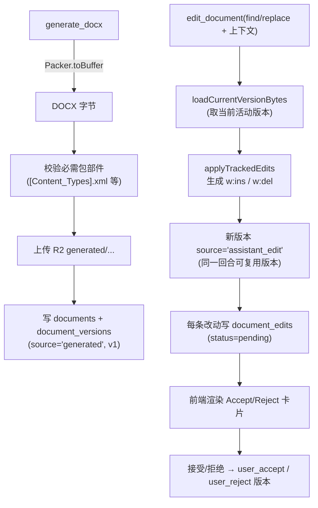
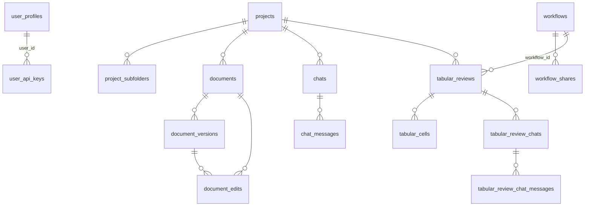
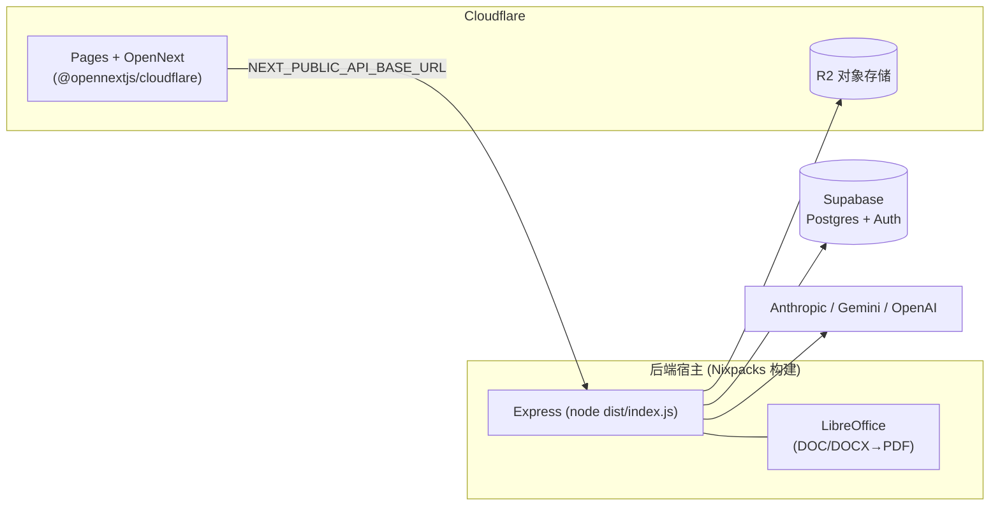

# Mike 项目分析：技术特点与用户痛点解决方案

> 分析日期：2026-06-02 ｜ 复核与扩充：2026-06-03（本版所有技术声明均已对照 `backend/src` 源码核实，并标注了与早期描述不一致之处）

## 一、项目概况

Mike 是一个 AI 驱动的法律文档助手（AGPL-3.0 许可），采用 monorepo 架构，包含 Next.js 前端和 Express 后端。

- **启动时间**：2026-04-29（首次提交）
- **截至分析日**：39 次提交，最新提交 2026-05-18，跨约 3 周的活跃开发
- **主要贡献者**：cosimoastrada（18）、willchen96（17），另有少量外部贡献
- **核心模块**：聊天助手（Assistant）、项目与文档管理（Projects/Documents）、表格审阅（Tabular Review）、工作流模板（Workflows）

---

## 二、架构总览

**关键点**：浏览器端的 Supabase 角色仅用于"登录"——所有业务表都被 `REVOKE ALL FROM anon, authenticated`，数据读写一律经 Express 后端用 service-role key 完成。前端持 JWT，后端用 `supabase.auth.getUser(token)` 校验后，将 `userId` / `userEmail` 放入 `res.locals`。

---

## 三、技术特点

### 1. 多 LLM 适配器架构

统一的 LLM 抽象层（`backend/src/lib/llm/`）。所有适配器内部统一使用 OpenAI 风格的 tool schema，再由 `toClaudeTools()` / `toGeminiTools()` 转换为各厂商原生格式（OpenAI 直接透传）。

- 支持 Anthropic Claude、Google Gemini、OpenAI GPT 三大模型族（`lib/llm/index.ts` 的 `streamChatWithTools` 按 provider 分发）。
- 路由实现见 `models.ts:providerForModel`：`claude*` → Anthropic，`gemini*` → Gemini，`gpt-*` → OpenAI，未知前缀直接抛错。
- **三档模型体系**（`models.ts`，早期描述未涵盖）：
  - **MAIN（主聊天）**：`claude-opus-4-7`、`claude-sonnet-4-6`、`gemini-3.1-pro-preview`、`gemini-3-flash-preview`、`gpt-5.5`、`gpt-5.4-mini`
  - **MID（表格审阅）**：`claude-sonnet-4-6`、`gemini-3-flash-preview`、`gpt-5.4-mini`
  - **LOW（标题生成、轻量抽取）**：`claude-haiku-4-5`、`gemini-3.1-flash-lite-preview`、`gpt-5.4-nano`
  - 默认值：主聊天与表格审阅均为 `gemini-3-flash-preview`，标题生成为 `gemini-3.1-flash-lite-preview`。
- **思考预算控制**（`enableThinking`）：交互式聊天开启思考流（Gemini 侧 `includeThoughts`），批量抽取场景关闭（`thinkingBudget: 0`）以省 token 和延迟。
- **BYOK（Bring Your Own Key）**：用户可上传自己的 API Key，AES-256-GCM 加密存于 `user_api_keys` 表。
- **⚠️ 优先级修正**：实际代码中**平台环境变量 Key 优先于用户 Key**，而非"环境变量作为 fallback"。`getUserApiKeys` 先以 env key 填充，遍历用户 key 时若该 provider 已有 env key 则跳过——即用户 BYOK Key 仅在该 provider **没有**平台 env key 时才生效。这一点对合规叙事有影响，详见第七节。

### 2. Function Calling 驱动的 Agent 能力

AI 不只是聊天——它通过 tool calling 实际操作文档。工具按使用场景**分组装配**（`runLLMStream` 中 `activeTools = [...TOOLS, ...WORKFLOW_TOOLS, ...extraTools]`）：

| 分组 | 工具 | 功能 |
|------|------|------|
| 基础（始终可用） | `read_document` | 读取文档全文（优先返回当前修订版本，而非原始上传） |
| 基础 | `find_in_document` | 文档内搜索（Ctrl+F 等价；大小写/空白容错，返回带上下文的命中） |
| 基础 | `generate_docx` | 生成带法律编号格式的 Word 文档 |
| 基础 | `edit_document` | 以 find/replace + 前后上下文锚定，产出 `<w:ins>`/`<w:del>` 修订 |
| 工作流 | `list_workflows` / `read_workflow` | 发现并加载工作流模板 |
| 项目（项目内聊天） | `list_documents` | 列出项目中所有文档 |
| 项目 | `fetch_documents` | 单次批量读取多份文档 |
| 项目 | `replicate_document` | 字节级复制文档作模板（单次最多 20 份） |
| 表格审阅（审阅内聊天） | `read_table_cells` | 读取表格审阅的提取结果（按行/列下标切片） |

Agent 循环是有界的：`streamChatWithTools` 以 `maxIterations: 10` 迭代——模型产出工具调用 → `runToolCalls` 执行并把结果回灌 → 再次推理，最多 10 轮。

### 3. SSE 实时流式传输 + Agent 循环

聊天采用 Server-Sent Events，逐行 `data: {JSON}\n\n`。下图是一次带工具调用的完整时序：

**⚠️ 事件名修正**：需区分**流式 wire 事件**与**持久化事件**两套命名：

- **流式（写给浏览器的实际事件名）**：`chat_id`、`content_delta`、`reasoning_delta`、`reasoning_block_end`、`tool_call_start`、`doc_read_start` / `doc_read`、`doc_find_start` / `doc_find`、`doc_created`、`doc_edited`、`doc_replicated`、`workflow_applied`、`error`、`[DONE]`。
- **持久化（存入 `chat_messages.content` 的 `events[]` 类型）**：`content`、`reasoning` 等。早期描述把持久化的 `content` / `reasoning` 当成了 wire 事件名，实际线上传输用的是 `*_delta` 形式。

**CITATIONS 流式剥离**：`streamVisibleContent` 在增量中探测 `<CITATIONS>` 起始标记，一旦出现就停止向用户推送可见文本——因此用户永远看不到原始引用 JSON，引用块仅在服务端解析为结构化 annotation。

### 4. DOCX 原生生成、编辑与修订追踪

`generateDocx`（`chatTools.ts`）用 `docx` 库构建文档；`docxTrackedChanges.ts` 直接操作 DOCX 的 OpenXML 结构做增量编辑。

- **法律编号**（`legalNumberingLevels`，已逐级核实）：`1.` → `1.1` → `(a)` → `(i)` → `(A)`，正文 Times New Roman 11pt。
- 前言（Recitals / WHEREAS）不编号；签名块独立分页、纯文本不编号；标题不重复编号前缀——均由生成器规则（`isUnnumberedHeading` / `isTitleLikeFirstHeading` 等）保证。
- **版本模型**：`document_versions.source` 取值 `upload` / `user_upload` / `assistant_edit` / `user_accept` / `user_reject` / `generated`；版本号在 upload+user_upload+assistant_edit 之间连续递增（原始上传 = V1，首次助手编辑 = V2）。同一助手回合内的多次 `edit_document` 会复用同一版本行（`turnEditState`），避免版本爆炸。
- 修订逐条存于 `document_edits`，状态 `pending` / `accepted` / `rejected`，支持逐条接受/拒绝。
- 处理了 Windows/Word 生成的 zip 路径兼容问题，且**不依赖 Word 或 LibreOffice 进行编辑**——纯代码操作 OpenXML（LibreOffice 仅用于 DOC/DOCX→PDF 的"转换"，非编辑）。

### 5. 结构化引用系统

AI 回复时遵循严格引用规范（定义在 `chatTools.ts:SYSTEM_PROMPT`，并由 `normalizeCitation` 容错解析）：

- 行内标记 `[1]`、`[2]` 对应文末 `<CITATIONS>` JSON 块的 `ref` 字段——明确强调 `[N]` 是 ref 序号，**不是**页码/脚注号/章节号。
- 每条引用含 `doc_id`（必须是 chat-local 标签如 `doc-0`，不可用文件名或 UUID）、`page`、`quote`（原文逐字引述，建议 ≤ 25 词）。
- `page` 基于文本中的 `[Page N]` 顺序标记（从首页 1 起），**忽略**文档自身页脚/罗马数字编号。
- 跨页引文：`page` 设为 `"N-M"`，并在 quote 中插入 `[[PAGE_BREAK]]`。
- 解析器兼容旧式 `marker` / `text` 键，并对非法 page 值兜底为 1。
- 每次 `read_document` / `fetch_documents` 的工具结果都会附带一段 `citationReminder`，强制模型为该文档使用正确的 `doc_id`。

### 6. 严格的安全架构

- **前端零直连数据库**：`schema.sql` 末尾对全部 16 张业务表执行 `revoke all ... from anon, authenticated`；浏览器无法直接读写任何业务数据。
- **统一鉴权中间件** `requireAuth`（`middleware/auth.ts`）：要求 `Authorization: Bearer <jwt>`，用 admin client `auth.getUser(token)` 校验，写入 `res.locals.userId` / `res.locals.userEmail`。
- **应用层访问控制**（`lib/access.ts`）：`checkProjectAccess` / `ensureDocAccess` / `ensureReviewAccess` 统一检查 "owner OR `shared_with` 邮箱命中"；`filterAccessibleDocumentIds` 防止用户在表格审阅里塞入无权限的文档 UUID。
- **用户 API Key 加密**（`userApiKeys.ts`）：AES-256-GCM，密钥由 `USER_API_KEYS_ENCRYPTION_SECRET` 经 SHA-256 派生；每次加密用 12 字节随机 IV，`encrypted_key` / `iv` / `auth_tag` 分列存储；解密失败安全降级为 null。
- **HMAC 签名下载**（`downloadTokens.ts`）：token = base64url(payload) + "." + base64url(HMAC-SHA256)，校验用 `timingSafeEqual` 防时序攻击。**注意：该 token 永不过期**——这是为了让聊天历史里的下载链接长期可用而做的刻意权衡（详见第七节风险）。

---

## 四、数据库结构

Supabase Postgres，无 ORM，直接用 Supabase 客户端 `.from().select().eq()`。无 RLS，安全完全由 Express 中间件层兜底。`schema.sql` 共定义 16 张表：

按域分组：

- **用户**：`user_profiles`（含 `tier`、`message_credits_used`、`credits_reset_date`、`tabular_model` 偏好）、`user_api_keys`（加密 BYOK key）。
- **项目与文档**：`projects`（`shared_with` JSONB + GIN 索引）、`project_subfolders`（自引用树）、`documents`、`document_versions`、`document_edits`。
- **工作流**：`workflows`（`is_system` 标记系统模板）、`hidden_workflows`（用户隐藏）、`workflow_shares`（按邮箱共享，`allow_edit` 控制读/写）。
- **聊天**：`chats`、`chat_messages`（`content` / `files` / `annotations` 均为 JSONB）。
- **表格审阅**：`tabular_reviews`、`tabular_cells`（每格 `content` + `citations` + `status`）、`tabular_review_chats`、`tabular_review_chat_messages`。

> **数据一致性观察**：`user_profiles.user_id` 是 `uuid` 且外键引用 `auth.users`，而 `projects` / `documents` / `chats` 等表的 `user_id` 是 **`text`** 且无外键约束。混用类型是可用的（代码层比较字符串），但牺牲了引用完整性，属可改进点。

**额度/计费系统**（早期描述未涵盖）：`user_profiles` 含 `tier`（默认 `Free`）、`message_credits_used`、`credits_reset_date`（默认 now()+30 天），表明存在按额度/周期计费的产品设计。

---

## 五、解决的用户痛点

### 痛点 1：法律文档审阅极其耗时

**现状**：律师审阅一份信贷协议可能需要数小时，手动提取关键条款、当事方信息、财务条件等。

**解决方案**：Mike 内置三个系统工作流模板（`backend/src/lib/builtinWorkflows.ts`），封装法律行业 know-how：

- **Credit Agreement Summary（信贷协议摘要）**：覆盖 **21 个维度**（已逐条核实）——Lenders、Borrowers、Guarantors、Other Parties、Date、Facilities、Amount、Purpose、Interest、Commitment Fee、Repayment Schedule、Maturity、Security、Guarantees、Financial Covenants、Events of Default、Assignment、Change of Control、Prepayment Fee、Governing Law、Dispute Resolution。该工作流要求**在聊天内直接输出**（明确指示 *不要* 调用 `generate_docx`，除非用户主动要 Word 文件）。
- **Generate CP Checklist（先决条件核查表）**：从融资文件抽取先决条件，强制 `generate_docx` 且 `landscape: true`，每个类别一张表，**固定 4 列**：Index、Clause Number、Clause、Status（Status 留空供用户填写）。
- **Shareholder Agreement Summary（股东协议摘要）**：覆盖 **15 个维度**（股权结构、各类股份权利、董事会治理、保留事项、优先认购、转让限制、ROFR、拖售/随售、反稀释、分红、退出、僵局、竞业等），并要求**生成可下载 Word 文档**。

> 注意三者输出形态不同：信贷摘要默认 inline、CP 核查表强制 landscape Word、SHA 摘要生成 Word——早期描述把它们笼统归为"一键生成结构化摘要"，实际行为有差异。所有摘要均要求带条款引用并标记非市场化条款。

### 痛点 2：多文档横向对比困难

**现状**：尽职调查需从数十份合同中提取同一维度信息（到期日、担保金额等），手动整理为对比表极繁琐。

**解决方案**：Tabular Review 跨多份文档提取同一维度并以表格呈现。每列可指定格式约束（实现于 `backend/src/routes/tabular.ts`，前端 `columns_config` 携带 `format`）：

| 格式 | 说明 | 示例输出 |
|------|------|----------|
| `bulleted_list` | Markdown 要点列表 | `* 条款一\n* 条款二` |
| `number` | 纯数字 | `42` |
| `percentage` | 百分比 | `42%` |
| `monetary_amount` | 金额（含货币符号） | `$1,234.56` |
| `currency` | 货币代码 | `[[USD]]` |
| `yes_no` | 是/否判断（附引文） | `[[Yes]]` |
| `date` | 日期 | `1 January 2024` |
| `tag` | 预定义标签分类 | `[[High Risk]]` |
| `text` | 自由文本（默认） | … |

抽取默认用 MID 档模型（`tabular_model`，默认 `gemini-3-flash-preview`），结果与引用分别存入 `tabular_cells.content` / `tabular_cells.citations`，并可在审阅内继续对话（`read_table_cells` 工具按行列读取已抽取结果）。

### 痛点 3：AI 生成的法律文件无法直接使用

**现状**：多数 AI 工具只输出纯文本/Markdown，律师仍需手动排版。

**解决方案**：Mike 直接生成带格式的 `.docx`，符合法律文档规范：

- 正确的条款编号层级：`1.` → `1.1` → `(a)` → `(i)` → `(A)`（生成器自动套用，模型只需给纯标题文本）。
- 前言不编号；签名页独立分页、含各方 By/Name/Title/Date 行；标题不重复编号前缀。
- 生成后可经 `edit_document` 增量修改并保留修订追踪；增删条款时系统提示要求模型同步更新所有下游编号与交叉引用。

### 痛点 4：法律团队的数据合规顾虑

**现状**：律所文件高度敏感，上传至第三方 AI 平台存在合规风险。

**解决方案与边界**：

- **BYOK 机制**：律所可使用自己的 API Key 直连 LLM 厂商。**但须注意**（见第三节修正）：当前实现中平台 env key 优先于用户 key——若想让 BYOK 真正"绕开平台凭据"，部署时**必须不为该 provider 配置平台 env key**，否则用户 key 会被忽略。
- **前端零直连数据库**：所有数据操作经后端鉴权，攻击面更小。
- **HMAC 签名下载**：链接带签名验证，防未授权访问（权衡：永不过期，见下节）。
- **加密存储用户密钥**：AES-256-GCM，独立于其它密钥。

---

## 六、部署架构

- **前端**：Next.js 16（App Router、React 19、React Compiler）、Tailwind 4、shadcn/ui，经 OpenNext 部署至 Cloudflare Pages。
- **后端**：Express 4 + TypeScript（`tsc → dist/`），用 Nixpacks 构建；`backend/nixpacks.toml` 在 setup 阶段注入 `libreoffice`，供 `libreoffice-convert` 做 DOC/DOCX→PDF 转换。
- **存储**：Cloudflare R2（S3 兼容，`@aws-sdk/client-s3`，`forcePathStyle`）。Key 规约：
  - 源文件 `documents/{userId}/{docId}/source.ext`
  - 转换 PDF `converted-pdfs/{userId}/{docId}.pdf`
  - 生成文档 `generated/{userId}/{docId}/generated.ext`
  - 编辑版本 `documents/{userId}/{docId}/edits/{versionId}.docx`
- **配置分离**：service-role key、R2 凭据、LLM key、下载签名密钥、加密密钥仅存于 `backend/.env`；前端 `.env.local` 只含 `NEXT_PUBLIC_*` 三项公开值。
- **工程现状**：无测试框架、无 CI/CD（据 CLAUDE.md）。

---

## 七、潜在风险与改进建议

| 主题 | 观察 | 建议 |
|------|------|------|
| **永不过期下载令牌** | `downloadTokens.ts` 的 HMAC token 无 TTL、无撤销机制，只要文件在、链接就一直有效；token 内嵌 R2 路径 + 文件名。 | 加入可选 `exp` 字段或版本化签名密钥，支持按需失效；敏感文档可改为短时效 R2 预签名 URL（`getSignedUrl` 已具备）。 |
| **BYOK 优先级反直觉** | 平台 env key 优先于用户 key，托管环境若配置了 env key，用户的 BYOK key 会被静默忽略，削弱合规卖点。 | 明确产品语义：要么"用户 key 优先"、要么在 UI 提示"当前由平台凭据服务"；至少让 `getUserApiKeyStatus` 的 source 对用户可见。 |
| **`user_id` 类型不一致** | `user_profiles.user_id` 为 uuid+FK，业务表多为 `text` 无 FK。 | 统一为 uuid 并补外键，换取引用完整性与级联删除一致性。 |
| **邮件通知未接线** | `resend@^4.5.1` 在 `backend/package.json` 中声明，但 `backend/src` 内**无任何引用**；工作流/审阅共享仅写入 `shared_with(_email)` 做访问控制，不发实际邮件。 | 要么接入 Resend 发送共享/邀请邮件，要么移除未使用依赖与 `.env` 中的 Resend key 以减小迷惑面。 |
| **无 RLS，纯应用层鉴权** | 安全完全依赖每个路由正确调用 `ensureDocAccess` 等；任一新路由遗漏即可能越权。 | 在 Supabase 层补一层 RLS 作为纵深防御；或对 access helper 增加集中式中间件/测试覆盖。 |
| **无自动化测试 / CI** | 重构（如修订追踪、编号逻辑）回归风险高。 | 优先为 `docxTrackedChanges`、`generateDocx` 编号、引用解析等纯函数补单测，并加最简 CI（lint + build + test）。 |
| **Agent 迭代硬上限 10** | 复杂多文档任务可能在 10 轮内未完成而截断。 | 将 `maxIterations` 设为按场景可配；超限时向用户显式提示而非静默结束。 |

---

## 八、核心差异化总结

Mike 不是通用的"AI 聊天 + 文档上传"工具，而是**垂直于法律文档工作流**的解决方案。核心差异化在于：

1. **结构化提取**（Tabular Review）—— 批量尽职调查自动化，列级格式约束 + 可追溯引用。
2. **原生 DOCX 生成/编辑/修订追踪** —— 纯代码操作 OpenXML，AI 产出可直接进入律师 Accept/Reject 工作流。
3. **内置法律领域 Workflow 模板** —— 信贷协议 21 维、SHA 15 维、CP 核查表，封装行业 know-how。
4. **多模型 + 三档分级 + BYOK** —— 在能力、成本与合规之间取得平衡。

> 本版已对照源码核实全部技术声明；若后续代码演进（模型 ID、事件名、工具集等会随版本变化），请以 `backend/src` 为准重新校验。
